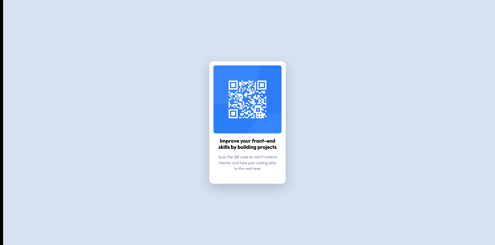

# Frontend Mentor - QR code component solution

This is a solution to the [QR code component challenge on Frontend Mentor](https://www.frontendmentor.io/challenges/qr-code-component-iux_sIO_H). Frontend Mentor challenges help you improve your coding skills by building realistic projects.

## Table of contents

- [Frontend Mentor - QR code component solution](#frontend-mentor---qr-code-component-solution)
  - [Table of contents](#table-of-contents)
  - [Screenshot](#screenshot)
  - [Built with](#built-with)
  - [Author](#author)

## Screenshot

## Built with

- [Bootstrap](https://getbootstrap.com/)

## Author

- Website - [Abuzer Emre Osmanoğlu](https://abuzeremre.com)
- Frontend Mentor - [@aeosmanoglu](https://www.frontendmentor.io/profile/aeosmanoglu)
- Twitter - [@abuzeremreo](https://twitter.com/abuzeremreo)
